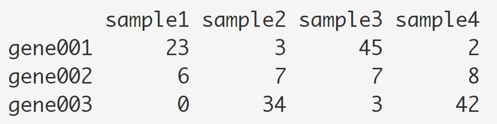
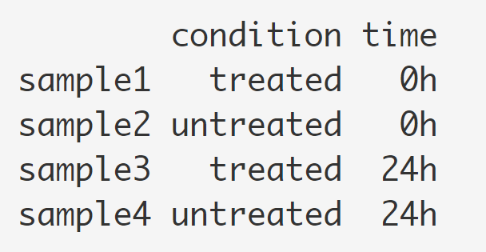

# Introduction

RNA-seq is an exciting experimental technique that is utilized to explore and/or quantify gene expression within or between conditions.

We will be focused on the application of differential gene expression analysis for this notebook. Differential gene expression analysis allows us to explore the gene expression changes that occur in disease or between different conditions, by measuring the quantity of RNA expressed by all genes in each of the different conditions. 

Using this analysis we can answer questions such as:

- What genes are differentially expressed between conditions?

- Are there any trends in gene expression over time or across conditions?

- Which groups of genes change similarly over time or across conditions?

- What processes or pathways are important for my condition of interest?

# Loading libraries

For this analysis we will be using several R packages, some which have been installed from CRAN and others from Bioconductor. To use these packages (and the functions contained within them), we need to load the libraries. Add the following to your script and don’t forget to comment liberally!

```{r setup, include=FALSE}
# Hide all warnings and messages, show code
knitr::opts_chunk$set(warning = FALSE)
knitr::opts_chunk$set(message = FALSE)
knitr::opts_chunk$set(echo = TRUE)

bioc_packages <- c("DESeq2", "EnhancedVolcano")
cran_packages <- c("enrichR",
                   "ggpubr",
                   "pheatmap",
                   "ggplot2",
                   "VennDiagram",
                   "stringr",
                   "here")
bioc_np <-
  bioc_packages[!(bioc_packages %in% installed.packages()[, "Package"])]
cran_np <-
  cran_packages[!(cran_packages %in% installed.packages()[, "Package"])]
if (!require("BiocManager"))
  install.packages("BiocManager")

if (length(cran_np)) {
  install.packages(cran_np)
}

if (length(bioc_np)) {
  BiocManager::install(bioc_np)
}

# 'here' pacakge automatically sets working directory for us
library(here)
# DESeq2 provides methods to test for differential gene expression (DGE) analysis 
library(DESeq2)
# ‘ggplot2’ and its extension for publication ready plots
library(ggplot2)
library(ggpubr) 
# Volcano plot
library(EnhancedVolcano) 
# Heatmap
library(pheatmap) 
# enrichR provides functional gene set enrichment analysis
library(enrichR) 


```

# Loading dataset

## Count matirx

Usually, we use the 'count data' from RNA-seq or another high-throughput sequencing experiment, in the form of a matrix of integer values. The rows in the matrix correspond to genes, and the columns correspond to samples. In each position of the matrix you will have an integer value representing the total number of sequence reads that originated from a particular gene in a sample.

Analogously, for other types of assays, the rows of the matrix might correspond e.g. to binding regions (with ChIP-Seq) or peptide sequences (with quantitative mass spectrometry). We will list method for obtaining count matrices in sections below.



## Condition matrix

Condition matrices, also known as metadata, details the design of your experiment. In this type of matrix, every i-th row and j-th column refer to factor levels assigned to sample i and factor j. For example, if were to look at the samples given in the count data section, the metadata R output will look something like this:



```{r}
# Read the count matrix

counts <- read.csv("data/counts.csv")

# Read metadata
meta <- read.csv("data/meta.csv", stringsAsFactors = F)

# Remove rows with duplicated row names
if (length(which(duplicated.default(counts[, 1]))) > 0) {
  counts <- counts[-which(duplicated.default(counts[, 1]) == T),]
}

rownames(counts) <- counts[, 1]
counts <- counts[,-1]

# You can filter the genes with low counts, it is called most minimal filtering rule: removing rows of the dataset that have no counts, or only a count of 10 across all samples. The value can be adjusted based on your dataset condition.
keep <- rowSums(counts) >= 10

# For some datasets, it may make sense to perform additional filtering. For example, one can specify that at least 5 samples have a count of 10 or higher. One recommendation for the number of samples would be set to the smallest group size.
keep <- rowSums(counts >= 10) >= 5

counts <- counts[keep, ]


```

Let's have a look at our dataset. The filtered data has 17306 genes (rows) and 8 samples (columns).

```{r}
# Print the first 10 rows of the count matrix
counts[1:10, ]

# Print the metadata
meta

```

# Quality control 

## Data normalization 

The first step in the analysis workflow is count normalization, which is necessary to make accurate comparisons of gene expression between samples.

The counts of mapped reads for each gene is proportional to the expression of RNA (“interesting”) in addition to many other factors (“uninteresting”). Normalization is the process of scaling raw count values to account for the “uninteresting” factors. In this way the expression levels are more comparable between and within samples.

Some of the main factors often considered during normalization are:

- **Sequencing depth**: Accounting for sequencing depth is necessary for comparison of gene expression between samples. In the example below, each gene appears to have doubled in expression in Sample A relative to Sample B, however this is a consequence of Sample A having double the sequencing depth.


- **Gene length**: Accounting for gene length is necessary for comparing expression between different genes within the same sample. In the example, Gene X and Gene Y have similar levels of expression, but the number of reads mapped to Gene X would be many more than the number mapped to Gene Y because Gene X is longer.

We will not discuss the normalization details here, we will use DESeq2 package (Differential gene expression analysis based on the negative binomial distribution)(Love, Huber, and Anders 2014), which integrates a suite functions for RNA-seq analysis.


## Load dataset in DESeq2

DESeq2 requires count matrix as the input for DESeq2’s statistical model to hold, as only the count values allow assessing the measurement precision correctly. The DESeq2 model internally corrects for library size, so transformed or normalized values such as counts scaled by library size should not be used as input.

```{r}

dds <- DESeq2::DESeqDataSetFromMatrix(
  countData = counts,
  colData = meta,
  design = ~ treatment
)

vsd <- vst(dds, blind = FALSE)

```

## Principal component analysis (PCA)

A useful initial step in an RNA-seq analysis is often to assess overall similarity between samples:

- Which samples are similar to each other, which are different?

- Does this fit to the expectation from the experiment’s design?

- What are the major sources of variation in the dataset?

To explore the similarity of our samples, we will be performing sample-level QC using Principal Component Analysis (PCA) and hierarchical clustering methods. These methods/tools allow us to check how well similar the replicates are to each other (clustering) and to make sure that the experimental condition is the major source of variation in the data. Sample-level QC can also help identify any samples behaving like outliers; we can further explore any potential outliers to determine whether they need to be removed prior to DE analysis.

PCA plot is used for visualizing the overall effect of experimental covariates and batch effects.

**Essentially, if two samples have similar levels of expression for the genes that contribute significantly to the variation represented by a given PC (Principal Component), they will be plotted close together on the axis that represents that PC. ** Therefore, we would expect that biological replicates to have similar scores (because our expectation is that the same genes are changing) and cluster together. This is easiest to understand by visualizing some example PCA plots.

### PCA plot colored by treatment

```{r}
pcaData <- plotPCA(vsd, intgroup=c("treatment"), returnData=TRUE)
percentVar <- round(100 * attr(pcaData, "percentVar"))
ggplot(pcaData, aes(PC1, PC2, color=treatment)) +
  geom_point(size=3) +
  xlab(paste0("PC1: ",percentVar[1],"% variance")) +
  ylab(paste0("PC2: ",percentVar[2],"% variance")) + 
  coord_fixed() +
  theme_classic()

```

### PCA plot colored by time

```{r}

pcaData <- plotPCA(vsd, intgroup=c("time"), returnData=TRUE)
percentVar <- round(100 * attr(pcaData, "percentVar"))
ggplot(pcaData, aes(PC1, PC2, color=time, label=name)) +
  geom_point(size=3) +
  xlab(paste0("PC1: ",percentVar[1],"% variance")) +
  ylab(paste0("PC2: ",percentVar[2],"% variance")) + 
  coord_fixed()+
  theme_classic()

```

# Diffrential gene expression analysis

Internally, DESeq2 is performing a number of steps but here we will focus on describing the count modeling and hypothesis testing. Modeling is a mathematically formalized way to approximate how the data behaves given a set of parameters.

The purpose of a test for differential expression is to test whether the data provides sufficient evidence to conclude that this value is really different from zero. DESeq2 performs for each gene a hypothesis test to see whether evidence is sufficient to decide against the **null hypothesis that there is zero effect of the treatment on the gene and that the observed difference between treatment and control was merely caused by experimental variability**. As usual in statistics, the result of this test is reported as a p-value, and it is found in the column pvalue. 

## day7 treatment vs day7 control

Here, we perform a simple treatment vs control DGE on day7 samples:

```{r}

s1 <-
  subset(meta,
         meta$treatment == "treatment" & meta$time == "day7")
s2 <- subset(meta, meta$treatment == "control" & meta$time == "day7")

cells.1 = rownames(s1)
cells.2 = rownames(s2)

group.info <- data.frame(row.names = c(cells.1, cells.2))
group.info[cells.1, "group"] <- "Group1"
group.info[cells.2, "group"] <- "Group2"
group.info[, "group"] <- factor(x = group.info[, "group"])
group.info$wellKey <- rownames(x = group.info)

dds1 <- DESeq2::DESeqDataSetFromMatrix(countData = counts[, as.numeric(c(cells.1, cells.2))],
                                       colData = group.info,
                                       design = ~ group)
dds1 <- DESeq2::estimateSizeFactors(object = dds1)
dds1 <-
  DESeq2::estimateDispersions(object = dds1, fitType = "local")
dds1 <- DESeq2::nbinomWaldTest(object = dds1)
res <- DESeq2::results(object = dds1,
                       contrast = c("group", "Group1", "Group2"))
result <- as.data.frame(res[order(res$padj), ])


summary(res, alpha = 0.05)

#write.csv(result,"comparison1.csv")

```

## Print DEG table 

We can print out the differentially expressed genes (DEGs) table:


The first column, **baseMean**, is the average of the normalized count values, divided by the size factors, taken over all samples in the DESeqDataSet.

The column **log2FoldChange** is the effect size estimate. It tells us how much the gene’s expression seems to have changed due to treatment in comparison to untreated samples. In another words, This value is reported on a logarithmic scale to base 2: for example, a log2 fold change of 1.5 means that the gene’s expression is increased by a multiplicative factor of $2^{1.5} \approx 2.82$. A positive log2 fold-change values show that the gene is more highly expressed in the first group and is labelled as 'up-regulated'.

**lfcSE**, the standard error estimate for the log2 fold change estimate, meaning its uncertainty associated with fold changes.

**p-value and adj.p.value:**

From a statistical point of view, for each gene we are testing the null hypothesis that there is no differential expression across the sample groups. This may represent thousands of tests. The more genes we test, the more we inflate the false positive rate. **This is the multiple testing problem**.

For example, the p-value with a significance cut-off of 0.05 means there is a 5% chance of error. If we test 20,000 genes for differential expression, at p < 0.05 we would expect to find 1,000 genes by chance. If we found 3000 genes to be differentially expressed total, roughly one third of our genes are false positives. We would not want to sift through our “significant” genes to identify which ones are true positives.

The common approaches for multiple test correction are Bonferroni, FDR/Benjamini-Hochberg, Q-value / Storey method. DESeq2 uses FDR by default.

>**So what does adj.p.value < 0.05 mean?** The most commonly used method is the FDR. By setting the FDR/Benjamini-Hochberg cutoff to < 0.05, we’re saying that the proportion of false positives we expect amongst our differentially expressed genes is 5%. For example, if you call 500 genes as differentially expressed with an FDR cutoff of 0.05, you expect 25 of them to be false positives.

**Remember that a p-value indicates the probability that a fold change as strong as the observed one, or even stronger, would be seen under the situation described by the null hypothesis**.

```{r}

DT::datatable(
  result[result$padj<0.05, c(1,2,5,6)],
  extensions = 'FixedColumns',
  options = list(
    pageLength = 10,
    scrollX = TRUE,
    scrollCollapse = TRUE,
    dom = 'Bfrtip',
    buttons = c('copy', 'csv', 'excel', 'pdf', 'print')
  )
)


```


## Visualization: MA-plot

The MA-plot visualize the log2 fold-change (M) on Y-axis and log of the mean of expression counts of samples (A) on X-axis. Genes with similar expression values in both compared groups will cluster around M=0 value (grey dots). i.e genes expressed with no significant differences in two groups. Up-regulated genes are colored in red, and down-regulated genes are colored in blue. I annotated 10 genes with smallest p-values in the figure. 

```{r}

ggmaplot(result,
         fdr = 0.05, fc = 1.5, size = 0.5,
         palette = c("#B31B21", "#1465AC", "darkgray"),
         genenames = as.vector(rownames(result)),
         legend = "top", top = 10,
         font.label = c("bold", 11),
         font.legend = "bold",
         font.main = "bold",
         ggtheme = ggplot2::theme_minimal())
```

### Visualization: Volcano plot

The volcano plot visualize the log of the p-value on Y-axis and log fold change of samples on X-axis. 

The dashed line is the cutoff to annotate differentially expressed genes, here the cut-off for log2 fold-change is >|1.5|; the cut-off for the adjusted P value is 0.05. 

This results in data points with low p values (highly significant) appearing toward the top of the plot. Points that are found toward the top of the plot that are far to either the left- or right-hand sides represent values that display large magnitude fold changes (hence being left or right of center) as well as high statistical significance. 

```{r}

top_up <- rownames(result[which(result$log2FoldChange > 0),])[1:5]
top_down <- rownames(result[which(result$log2FoldChange < 0),])[1:5]

EnhancedVolcano(result,
    lab = rownames(result),
    x = 'log2FoldChange',
    y = 'padj',
    selectLab = c(top_up,top_down),
    pCutoff = 0.05,
    FCcutoff = 1.5,
    )
    
```

# Functional enrichment analysis for DEGs

To gain greater biological insight into the differential expression results, functional analyses cover a range of techniques. 

Here, we use Enrichr package to perform over-representation analysis. It compares the proportion of genes associated with a particular process/pathway in the list of differentially expressed genes to the proportion of genes associated with that pathway in a background list (genes tested for DE). The over-representation analyses identify processes/pathways related to 
genes exhibiting larger changes in expression between the conditions.

We use two popular funtional annotation databases:

- Gene Ontology: genes associated with particular biological processes, cellular components, and molecular functions 

- KEGG: genes associated with particular biological pathways

## GO Biological Process

```{r}

## Select Gene ontology and KEGG pathway databases
dbs <- c("GO_Molecular_Function_2018", "GO_Cellular_Component_2018", "GO_Biological_Process_2018","KEGG_2019_Human")

# This select genes with adj.p.value < 0.05 and log2foldchange > 1.5 for enrichment analysis

enriched_combined <- enrichr(rownames(result[which(result$padj < 0.05 & abs(result$log2FoldChange) > 1.5),]),dbs)

# We only print the top 20 enriched terms
DT::datatable(head(enriched_combined$GO_Biological_Process_2018,n=20)[,c(-3,-5,-6,-7)], extensions = c('FixedColumns','Buttons'),
              options = list(
                pageLength = 5,
                scrollX = TRUE,
                scrollCollapse = TRUE,
                dom = 'Bfrtip',
                buttons = c('copy', 'csv', 'excel')
              ))
```

#### GO Cellular Component

```{r}

DT::datatable(head(enriched_combined$GO_Cellular_Component_2018,n=20)[,c(-3,-5,-6,-7)], extensions = c('FixedColumns','Buttons'),
              options = list(
                pageLength = 5,
                scrollX = TRUE,
                scrollCollapse = TRUE,
                dom = 'Bfrtip',
                buttons = c('copy', 'csv', 'excel')
              ))
```

#### GO Molecular Function

```{r}

DT::datatable(head(enriched_combined$GO_Molecular_Function_2018,n=20)[,c(-3,-5,-6,-7)], extensions = c('FixedColumns','Buttons'),
              options = list(
                pageLength = 5,
                scrollX = TRUE,
                scrollCollapse = TRUE,
                dom = 'Bfrtip',
                buttons = c('copy', 'csv', 'excel')
              ))
```

#### KEGG pathway

```{r}

DT::datatable(head(enriched_combined$KEGG_2019_Human,n=20)[,c(-3,-5,-6,-7)], extensions = c('FixedColumns','Buttons'),
              options = list(
                pageLength = 5,
                scrollX = TRUE,
                scrollCollapse = TRUE,
                dom = 'Bfrtip',
                buttons = c('copy', 'csv', 'excel')
              ))
```


# Reference

Rmarkdown reference: [Reference](https://rstudio.com/wp-content/uploads/2015/03/rmarkdown-reference.pdf)

How to experimental design in DESeq2 (https://rpubs.com/ge600/deseq2)

[Mathematics in Rmarkdown](https://www.calvin.edu/~rpruim/courses/s341/S17/from-class/MathinRmd.html)

[Analyzing RNA-seq data with DESeq2](http://bioconductor.org/packages/release/bioc/vignettes/DESeq2/inst/doc/DESeq2.html#independent-hypothesis-weighting)

[RNA-seq workflow: gene-level exploratory analysis and differential expression](http://bioconductor.org/packages/release/bioc/vignettes/IHW/inst/doc/introduction_to_ihw.html#an-example-rna-seq-differential-expression)

[RNA-seq analysis is easy as 1-2-3 with limma, Glimma and edgeR](https://www.bioconductor.org/packages/devel/workflows/vignettes/RNAseq123/inst/doc/limmaWorkflow.html)

[RNA-seq workshop from Harvard Medical School](https://github.com/hbctraining/Training-modules)

# Session Infomation

```{r, echo=T,eval=T,message=F,warning=F,error=T}
sessionInfo()
```
---
*The lesson material has been developed by members of the BMBL.*
