# Introduction

Learning Objectives

- Describe R and RStudio.

- Interact with R using RStudio.

- Use the various features of RStudio.

- Learn basic R operation.

- Generate the same RMarkdown report in HTML format. 

## What is R?

The common misconception is that R is a programming language but in fact it is much more than that. Let's think of R as an environment for statistical computing and graphics, which brings together a number of features to provide powerful functionality.

The R environment combines:

- effective handling of big data

- collection of integrated tools

- graphical facilities

- simple and effective programming language

## Why use R?


R is a powerful, extensible environment. It has a wide range of statistics and general data analysis and visualization capabilities.

- Data handling, wrangling, and storage

- Wide array of statistical methods and graphical techniques available

- Easy to install on any platform and use (and it’s free!)

- Open source with a large and growing community of peers


## What is RStudio?

RStudio is freely available open-source Integrated Development Environment (IDE). RStudio provides an environment with many features to make using R easier and is a great alternative to working on R in the terminal.

- Graphical user interface, not just a command prompt

- Great learning tool

- Free for academic use

- Platform agnostic

- Open source


## RStudio Interface

The RStudio interface has four main panels:

- Console: where you can type commands and see output. The console is all you would see if you ran R in the command line without RStudio.

- Script editor: where you can type out commands and save to file. You can also submit the commands to run in the console.

- Environment/History: environment shows all active objects and history keeps track of all commands run in console

- Files/Plots/Packages/Help

## What is R Markdown?

A markup language is a system for annotating text documents in order to e.g. define formatting. HTML, if you are familiar with that, is an example of a markup language. HTML uses tags, such as:

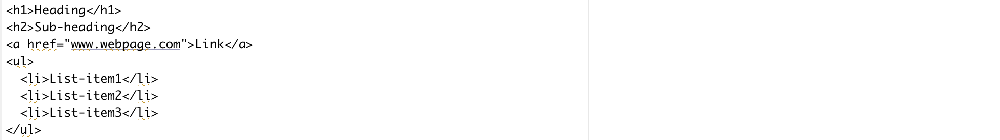

Markdown is a lightweight markup language which uses plain-text syntax in order to be as unobtrusive as possible, so that a human can easily read it. Some examples:

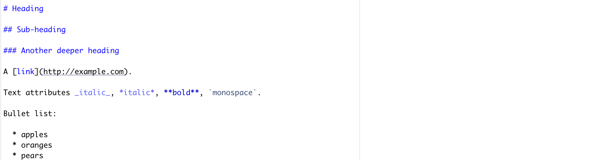

A markdown document can be converted to other formats, such as HTML or PDF, for viewing in a browser or a PDF reader; the page you are reading right now is written in markdown. Markdown is somewhat ill-defined, and as a consequence of that there exists many implementations and extensions, although they share most of the syntax. R Markdown is one such implementation/extension.

R Markdown documents can be used both to save and execute code (with a focus on R) and to generate reports in various formats. This is done by mixing markdown (as in the example above), and so-called code chunks in the same document. The code itself, as well as the output it generates, can be included in the final report.

R Markdown makes your analysis more reproducible by connecting your code, figures and descriptive text. You can use it to make reproducible reports, rather than e.g. copy-pasting figures into a Word document. You can also use it as a notebook, in the same way as lab notebooks are used in a wet lab setting.

If you want to read more, here are some useful resources:

  * A nice "Get Started" section, as a complement to this tutorial, is available at [RStudio.com](https://rmarkdown.rstudio.com/lesson-1.html).
  * [R Markdown reference guide](https://www.rstudio.com/wp-content/uploads/2015/03/rmarkdown-reference.pdf) (also available from Help --> Cheatsheets in RStudio)
  
This tutorial depends on files from the course GitHub repo. Take a look at the [setup](https://nbis-reproducible-research.readthedocs.io/en/latest/setup/) for instructions on how to set it up if you haven't done so already. Place yourself in the 'rmarkdown/' directory, activate your 'rmarkdown-env' Conda environment and start RStudio from the command line (type 'rstudio &')

# Build a report in R Markdownt 


## Writing in R Markdown
Let's begin with starting RStudio and opening a new file (File --> New File --> R Markdown). If you're using Conda you should have all the packages needed, but install anything that RStudio prompts you to. In the window that opens, select *Document* and *HTML* (which should be the default), and click *Ok*. This will open a template R Markdown document for you. On the top is a so called YAML header:

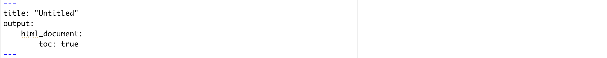

Here we can specify settings for the document, like the title and the output format.

  * Change the title to `My first R Markdown document`
  
Now, read through the rest of the template R Markdown document to get a feeling for the format. As you can see, there are essentially three types of components in an R Markdown document:

  * Text (written in R Markdown)
  * Code chunks (written in R or another [supported language](https://nbis-reproducible-research.readthedocs.io/en/latest/rmarkdown/#r-markdown-and-other-languages))
  * The YAML header
  
Let's dig deeper into each of these in the following sections! But first, just to get the flavor for things to come: press the little *Knit*-button located at the top of the text editor panel in RStudio. This will prompt you to save the Rmd file (do that), and generate the output file (an HTML file in this case). It will also open up a preview of this file for you.

Some commonly used formatting written in markdown is shown below:

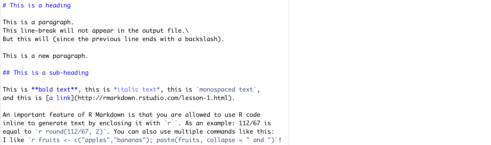

The above markdown would generate something like this:

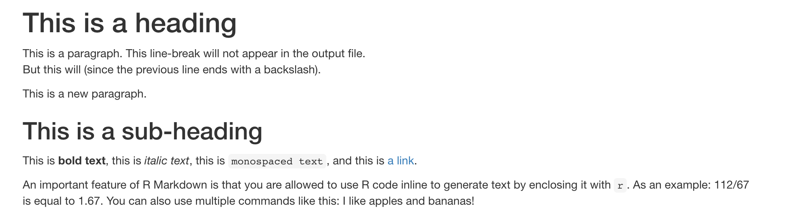

Instead of reiterating information here, take a look on the first page (only the first page!) of this [reference](https://www.rstudio.com/wp-content/uploads/2015/03/rmarkdown-reference.pdf). This will show you how to write more stuff in markdown and how it will be displayed once the markdown document is converted to an output file (*e.g.* HTML or PDF). An even more complete guide is available [here](https://rmarkdown.rstudio.com/authoring_pandoc_markdown.html).

Try out some of the markdown described above (and in the links) in your template R Markdown document! Press *Knit* to see the effect of your changes. Don't worry about the code chunks just yet, we'll come to that in a second.


## Code chunks

Enough about markdown, let's get to the fun part and include some code! Look at the last code chunk in the template R Markdown document that you just created, as an example:

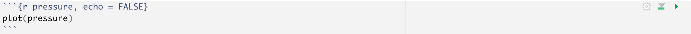

The R code is surrounded by: ` ```{r} ` and ` ``` `. The `r` indicates that the code chunk contains R code (it is possible to add code chunks using other languages, *e.g.* Python). After that comes an optional chunk name, `pressure` in this case (this can be used to reference the code chunk as well as alleviate debugging). Last comes chunk options, separated by commas (in this case there is only one option: `echo = FALSE`).

<div style="color: blue;">
 Note that the code chunk name pressure has nothing to do with the code plot(pressure). In the latter case, pressure is a default R dataframe that is used in examples. The chunk name happene
</div>

Below are listed some useful chunk options related to evaluating and displaying code chunks in the final file:

|Chunk option|Effect|
|--- |--- |--- |
|`echo = FALSE`|Prevents code, but not the results, from appearing in the finished file. This is a useful way to embed figures.
|`include = FALSE`|Prevents both code and results from appearing in the finished file. R Markdown still runs the code in the chunk, and the results can be used by other chunks.
|`eval = FALSE`|The code in the code chunk will not be run (but the code can be displayed in the finished file). Since the code is not evaluated, no results can be shown.
|`results = "hide"`|Evaluate (and display) the code, but don't show the results.
|`message = FALSE`|Prevents messages that are generated by code from appearing in the finished file.
|`warning = FALSE`|Prevents warnings that are generated by code from appearing in the finished file.

  * Go back to your template R Markdown document in RStudio and locate the `cars` code chunk.
  * Add the option `echo = FALSE`:
  
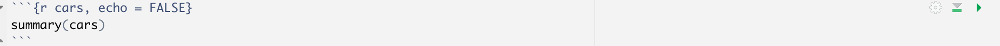

  * How do you think this will affect the rendered file? Press *Knit* and check if you were right.
  * Remove the `echo = FALSE` option and add `eval = FALSE` instead:
  
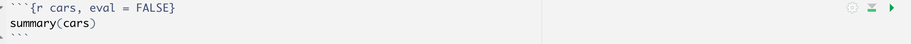

How do you think this will affect the rendered file? Press *Knit* and check if you were right.
Remove the `eval = FALSE` option and add `include = FALSE` instead:

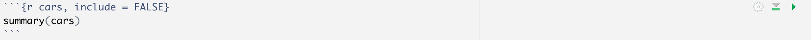

There are also some chunk options related to plots:

|Chunk option|Effect|
|--- |--- |--- |
|`fig.height = 9, fig.width = 6`|Set plot dimensions to 9x6 inches. (The default is 7x7.)
|`out.height = "10cm", out.width = "8cm"`|Scale plot to 10x8 cm in the final output file.
|`fig.cap = "This is a plot."`|Adds a figure caption.

  * Go back to your template R Markdown document in RStudio and locate the `pressure` code chunk.
  * Add the `fig.width` and `fig.height` options as below:
  
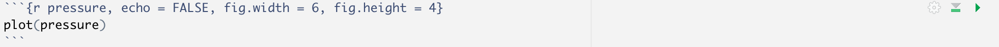

  * Press *Knit* and look at the output. Can you see any differences?
  * Now add a whole new code chunk to the end of the document. Give it the name `pressure 2` (code chunks have to have unique names). Add the `fig.width` and `out.width` options like this:
  
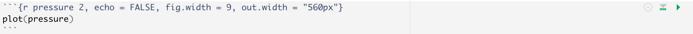

  * Press *Knit* and look at the output. Notice the difference between the two plots? In the second chunk we have first plotted a figure that is a fair bit larger (9 inches wide) than that in the first chunk. Next we have down-sized it in the final output, using the `out.width` option (where we need to use a size metric recognized by the output format, in this case "560px" which works for HTML).

Have you noticed the first chunk?

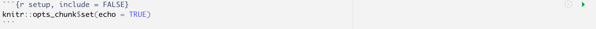

In this way we can set global chunk options, *i.e.* defaults for all chunks. In this example, `echo` will always be set to `TRUE`, unless otherwise specified in individual chunks.

Global options should be placed inside your `setup` code chunk. The `setup` chunk is a special knitr chunk that should be placed at the start of the document. It's recommended to storing all `library()` loads required for the script in this `setup` chunk too!

<div style="color: blue;">
  For more chunk options, have a look at page 2-3 of this [reference](https://www.rstudio.com/wp-content/uploads/2015/03/rmarkdown-reference.pdf).
</div>

### Adding plots

It is also possible to create different types of interactive plots using R Markdown. You can see some examples of this [here](http://www.htmlwidgets.org/showcase_networkD3.html). If you want to try it out you can add the following code chunk to your document:

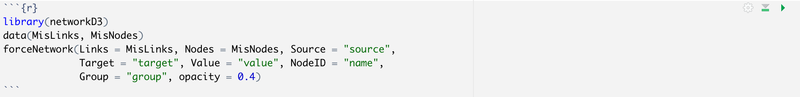

### Adding tables

`knitr` includes a simple but powerful function for generating stylish tables in a knit report named `kable()`. 

There are some other functions that allow for more powerful customization of tables, including `pander::pander()` and `xtable::xtable()`, but the simplicity and cross-platform reliability of `knitr::kable()` makes it an easy pick.

### Working directory behavior

`knitr` redefines the working directory of an RMarkdown file in a manner that can be confusing. Make sure that any paths to files specified in the RMarkdown document is relative to its location, and not relative to your current working directory.

A simple way to make sure that the paths are not an issue is by creating an R project for the analysis, and saving all RMarkdown files at the top level and referring to the data and output files within the project directory. This will prevent unexpected problems related to this behavior.


## The YAML header

Last but not least, we have the YAML header. Here is where you configure general settings for the final output file, and a few other things.

The settings are written in [YAML format](https://en.wikipedia.org/wiki/YAML) in the form *key: value*. Nested settings or sub-settings are indented with spaces. In the template R Markdown document you can see that `html_document` is nested under `output`, and in turn, `toc` is nested under `html_document` since it is a setting for the HTML output. The table of contents (TOC) is automatically compiled from the section headers (marked by #).

  * Add a subsection header somewhere in your document using three `###`. Knit and look at how the table of contents is structured.
  * Now set `toc: false` and knit again. What happened?
  * A setting that works for HTML output is `toc_float: true`. Add that to your document (same indentation level as `toc: true`) and knit. What happened?
  * In the same way, add the option `number_sections: true`. What happened?
  * Do you think it looks weird with sections numbered with 0, *e.g.* 0.1? That is because the document does not contain any level-1-header. Add a header using only one `#` at the top of the document, just after the `setup` chunk. Knit and see what happens!
  
We can also set parameters in the YAML header. These are either character strings, numerical values, or logicals, and they can be used in the R code in the code chunks. Let's try it out:

  * Add two parameters, `data` and `color`, to the YAML header. It should now look something like this:

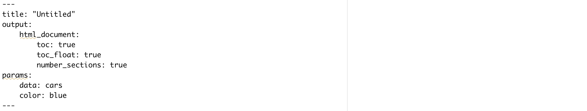

So now we have two parameters that we can use in the code! Modify the `pressure` code chunk so that it looks like this:

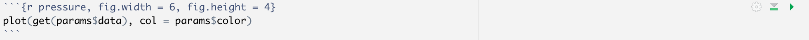

This will plot the dataset `cars` using the color `blue`, based on the parameters we set in the YAML header.

  * Knit and see what happens!

Later, we will learn how to set parameters using an external command.

We have up until now mainly been using `html_document` as an output format. There are however a range of different available formats to choose between. What is important to know, is that not all chunk settings work for all output formats (this mainly regards settings related to rendering plots and figures), and some YAML settings are specific for the given output format chosen.

  * Take a look at this [gallery](https://rmarkdown.rstudio.com/gallery.html) of R Markdown documents to see what different kinds of output formats are possible to generate.
  * Take a look at the last page of this [reference](https://www.rstudio.com/wp-content/uploads/2015/03/rmarkdown-reference.pdf) for a list of YAML header options, and what output formats they are available for.
  
## Rendering

You can render (sometimes called "knitting") reports in several different ways:

  * Pressing the *Knit* button in RStudio (as we have done this far)
  * Running the R command `render`: to Knit the file `my_file.Rmd` run `rmarkdown::render("my_file.Rmd")` in the R console.
  * Running from the command line: `R -e 'rmarkdown::render("my_file.Rmd")'`
  
Using the `render` command, we can also set YAML header options and change defaults (*i.e.* override those specified in the R Markdown document itself). Here are a few useful arguments (see `?rmarkdown::render` for a full list):

  * `output_format`: change output format, *e.g.* `html_document` or `pdf_document`
  * `output_file` and `output_dir`: change directory and file name of the generated report file (defaults to the same name and directory as the .Rmd file)
  * `params`: change parameter defaults. Note that only parameters already listed in the YAML header can be set, no new parameters can be defined
  
Try to use the `render` command to knit your template R Markdown document and set the two parameters `data` and `color`. Hint: the `params` argument should be a list, *e.g.*:

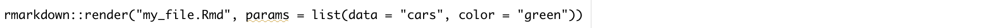


## RStudio and R Markdown

You might already have noticed the various ways in which you can run code chunks directly in RStudio:

  * Place the cursor on an R command and press `CTRL + Enter` (Windows) or `Cmd + Enter` (Mac) to run that line in R.
  * Select several R command lines and use the same keyboard shortcut as above to run those lines.
  * To the right in each chunk there are two buttons; one for running the code in all chunks above the current chunk and one for running the code in the current chunk (depending on your layout, otherwise you can find the options in the Run drop-down).
  * You can easily insert an empty chunk in your Rmd document in RStudio by pressing Code --> Insert Chunk in the menu.

Depending on your settings, the output of the chunk code will be displayed inline in the Rmd document, or in RStudio's Console and Plot panels. To customize this setting, press the cog-wheel next to the Knit button and select either "Chunk Output Inline" or "Chunk Output in Console". Additionally, in the top right in the editor panel in RStudio there is a button to toggle the document outline. By making that visible you can click and jump between sections (headers and named code chunks) in your R Markdown document.

# R Basic Command

## Assignment operator

Variables are assigned usually using the <- operator. The = operator also works in a similar way for most part.

```{r setup, include=FALSE}
# Hide all warnings and messages, show code
knitr::opts_chunk$set(warning = FALSE)
knitr::opts_chunk$set(message = FALSE)
knitr::opts_chunk$set(echo = TRUE)

```

```{r}

x <- 4
x = 4
x

```

## Arithmetic operators

The commonly used arithmetic operators are shown below returning a number.

```{r}

x <- 4
y <- 2

# add
x + y

# subtract
x - y

# multiply
x * y

# divide
x / y

# modulus
x %% y

# power
x ^ y

```

## Logical operators

Logical operators return a logical TRUE or FALSE.

```{r}

# equal to?
x == y

# not equal to?
x != y

# greater than?
x > y

# less than?
x < y

# greater than or equal to?
x >= y

# less than or equal to?
x <= y

```

## Data types

```{r}

class(1)
class("hello")
class(T)


```

```{r}

x <- c(2,3,4,5,6)
y <- c("a","c","d","e")
z <- factor(c("a","c","d","e"))
class(z)

```

```{r}

x <- matrix(c(2,3,4,5,6,7),nrow=3,ncol=2)
class(x)
str(x)

```

```{r}

dfr <- data.frame(x = 1:3, y = c("a", "b", "c"))
print(dfr)

```

```{r}

class(dfr)

```

```{r}

str(dfr)

```

## Accessors

Vectors positions can be accessed using []. R follows 1-based indexing.

```{r}

x <- c(2,3,4,5,6)
x
x[2]

```

Dataframe or matrix positions can be accessed using [] specifying row and column like [row,column].

```{r}

dfr <- data.frame(x = 1:3, y = c("a", "b", "c"))
dfr
dfr[1,]
dfr[,1]
dfr[2,2]

```

## Functions

```{r}

# generate 10 random numbers between 1 and 200
x <- sample(x=1:200,10)
x

# length
length(x)

# sum
sum(x)

# mean
mean(x)

# median
median(x)

# min
min(x)

# log
log(x)

# exponent
exp(x)

# square-root
sqrt(x)

# round
round(x)

# sort
sort(x)

```

Some useful string functions.

```{r}

a <- "sunny"
b <- "day"

# join
paste(a, b)

# find a pattern
grep("sun", a)

# number of characters
nchar("sunny")

# to uppercase
toupper("sunny")

# to lowercase
tolower("SUNNY")

# replace pattern
sub("sun", "fun", "sunny")

# substring
substr("sunny", start=1, stop=3)

```

Some general functions

```{r}

print("hello")
print("world")
cat("hello")
cat(" world")
cat("\nhello\nworld")

```

## Merging

Two strings can be joined together using paste().

```{r}

a <- "sunny"
b <- "day"

paste(a, b)
paste(a, b, sep="-")

```

The function c() is used to concatenate objects.

```{r}

a <- "sunny"
b <- "day"

c(a,b)

```

The function cbind() is used to join two dataframes column-wise.

```{r}

dfr1 <- data.frame(x = 1:3, y = c("a", "b", "c"))
dfr2 <- data.frame(p = 4:6, q = c("d", "e", "f"))
dfr1
dfr2

cbind(dfr1,dfr2)

```

Similarily, rbind() is used to join two dataframes row-wise.

```{r}

dfr1 <- data.frame(x = 1:3, y = c("a", "b", "c"))
dfr2 <- data.frame(x = 4:6, y = c("d", "e", "f"))
dfr1
dfr2

rbind(dfr1,dfr2)

```

Two dataframes can be merged based on a shared column using the merge() function.

```{r}

dfr1 <- data.frame(x = 1:4, p = c("a", "b", "c","d"))
dfr2 <- data.frame(x = 3:6, q = c("l", "m", "n","o"))
dfr1
dfr2

merge(dfr1,dfr2,by="x")
merge(dfr1,dfr2,by="x",all.x=T)
merge(dfr1,dfr2,by="x",all.y=T)
merge(dfr1,dfr2,by="x",all=T)

```

## Read and write files

ead comma separated file (csv) using read.csv function:

> table1 <- read.csv("example_table.csv")

Set the first column as the row names:

> table1 <- read.csv("example_table.csv", row.names = 1)

Or use the more general read.table function and specify the separater:

> table1 <- read.table("example_table.csv", sep = ",")

We will need to set the row names and column names manually:

> table1 <- read.table("example_table.csv", sep = ",", row.names = 1, header = T)

Write the variable to csv format using write.csv function:

> write.csv(table1, "example_table1.csv")

## Packages

### CRAN

The Comprehensive R Archive Network CRAN is the biggest archive of R packages. There are few requirements for uploading packages besides building and installing succesfully, hence documentation and support is often minimal and figuring how to use these packages can be a challenge it itself. CRAN is the default repository R will search to find packages to install:

> install.packages("YOUR_PACKAGE_NAME")

```{r, eval=F}

install.packages("devtools")

# or multiple packages

install.packages(c("ggplot2", "stringr"))

```

### BioConductor

Bioconductor is a repository of R-packages specifically for biological analyses. It has the strictest requirements for submission, including installation on every platform and full documentation with a tutorial (called a vignette) explaining how the package should be used. Bioconductor also encourages utilization of standard data structures/classes and coding style/naming conventions, so that, in theory, packages and analyses can be combined into large pipelines or workflows.

Bioconductor also requires creators to support their packages and has a regular 6-month release schedule. Make sure you are using the most recent release of bioconductor before trying to install packages for the course.


```{r, eval=F}
if (!requireNamespace("BiocManager", quietly = TRUE))
    install.packages("BiocManager")

BiocManager::install("PACKAGE_NAME", ask = FALSE)

```

### GitHub

GitHub isn’t specific to R, any code of any type in any state can be uploaded. There is no guarantee a package uploaded to github will even install, nevermind do what it claims to do. R packages can be downloaded and installed directly from github using the “devtools” package installed above.

```{r, eval=F}
devtools::install_github("username/repository")

```


## Graphics

### Base

R is an excellent tool for creating graphs and plots. The graphic capabilities and functions provided by the base R installation is called the base R graphics. Numerous packages exist to extend the functionality of base graphics.

We can try out plotting a few of the common plot types. Let’s start with a scatterplot. First we create a data.frame as this is the most commonly used data object.

```{r}

dfr <- data.frame(a=sample(1:100,10),b=sample(1:100,10))

```

Now we have a dataframe with two continuous variables that can be plotted against each other.

```{r}

plot(dfr$a,dfr$b)

```

This is probably the simplest and most basic plots. We can modify the x and y axis labels.

```{r}

plot(dfr$a,dfr$b,xlab="Variable a",ylab="Variable b")

```

We can change the point to a line.

```{r}

plot(dfr$a,dfr$b,xlab="Variable a",ylab="Variable b",type="b")

```

Let’s add a categorical column to our dataframe.

```{r}

dfr$cat <- rep(c("C1","C2"),each=5)

```

And then colour the points by category.

```{r}

# subset data
dfr_c1 <- subset(dfr,dfr$cat == "C1")
dfr_c2 <- subset(dfr,dfr$cat == "C2")

plot(dfr_c1$a,dfr_c1$b,xlab="Variable a",ylab="Variable b",col="red",pch=1)
points(dfr_c2$a,dfr_c2$b,col="blue",pch=2)

legend(x="topright",legend=c("C1","C2"),
       col=c("red","blue"),pch=c(1,2))

```

Let’s create a barplot.

```{r}

ldr <- data.frame(a=letters[1:10],b=sample(1:50,10))
barplot(ldr$b,names.arg=ldr$a)

```


### Grid

Grid graphics have a completely different underlying framework compared to base graphics. Generally, base graphics and grid graphics cannot be plotted together. The most popular grid-graphics based plotting library is ggplot2.

Let’s create the same plot are before using ggplot2. Make sure you have the package installed.

```{r}

library(ggplot2)

ggplot(dfr,aes(x=a,y=b,colour=cat))+
  geom_point()+
  labs(x="Variable a",y="Variable b")

```

It is generally easier and more consistent to create plots using the ggplot2 package compared to the base graphics.

Let’s create a barplot as well.

```{r}

ggplot(ldr,aes(x=a,y=b))+
  geom_bar(stat="identity")

```

## Input/Output

Input and output of data and images is an important aspect with data analysis.

### Text

Data can come in a variety of formats which needs to be read into R and converted to an R data type.

Text files are the most commonly used input. Text files can be read in using the function read.table. We have a sample file to use: iris.txt.

```{r}

#dfr <- read.table("iris.txt",header=TRUE,stringsAsFactors=F)

```

This reads in a tab-delimited text file with a header. The argument sep='\t' is set by default to specify that the delimiter is a tab. stringsAsFactors=F setting ensures that character columns are not automatically converted to factors.

It’s always a good idea to check the data after import.

```{r}

head(dfr)

```

```{r}

str(dfr)

```

Check ?read.table for other wrapper functions to read in text files.

Let’s filter this data.frame and create a new dataset.

```{r}

dfr1 <- dfr[dfr$Species == "setosa",]

```

And we can write this as a text file.

```{r}

write.table(dfr1,"iris-setosa.txt",sep="\t",row.names=F,quote=F)

```

sep="\t" sets the delimiter to tab. row.names=F denotes that rownames should not be written. quote=F specifies that doubles must not be placed around strings.

### Base graphics

The general idea for saving plots is open a graphics device, create the plot and then close the device. We will use png here. Check out ?png for the arguments and other devices.

```{r}

dfr <- data.frame(a=sample(1:100,10),b=sample(1:100,10))

png(filename="plot-base.png")
plot(dfr$a,dfr$b)
dev.off()

```

### ggplot2

The same idea can be applied to ggplot2, but in a slightly different way. First save the file to a variable, and then export the plot.

```{r}

p <- ggplot(dfr,aes(a,b)) + geom_point()

png(filename="plot-ggplot-1.png")
print(p)
dev.off()

```

ggplot2 also has another easier helper function to export images.

```{r}

ggsave(filename="plot-ggplot-2.png",plot=p)

```


# Practice

## Exercise #1

  1. Scroll down to the end of the `workshop-example.Rmd` document. **Add a new code chunk.** Within the code chunk place the code `sessionInfo()`.
  2. **Add a new section header** above the newly created code chunk. Use a title that best describes the output. Have this header be the same size as the “Project details” header.
  3. **Modify the `author` and `title`** parameters at the top of the script to have your name and your chosen title
  4. **Knit the markdown.**

<div style="color: blue;">
  [Answer Key](https://raw.githubusercontent.com/hbctraining/Training-modules/master/Rmarkdown/data/workshop-answer-activity3.Rmd)
</div>


## Exercise #2

  1. Only some of the code chunks in the `workshop-example.Rmd` file have names; go through and **add names to the unnamed code chunks**.
  2. For the code chunk named `data-ordering` do the following:
    * First, **add a new line of code** to display first few rows of the newly created `data_ordered` data frame. You may use `head()` function here.
    * Next, **modify the options** for (`{r data-ordering}`) such that in the knitted report, the output from the new line of code will show up, but the code is hidden.
  3. Without removing the second-to-last code chunk (`{r boxplot}`) from the Rmd file, **modify its options** such that neither the code nor its output appear in the report
  4. **knit the markdown**
  
<div style="color: blue;">
  [Answer Key](https://raw.githubusercontent.com/hbctraining/Training-modules/master/Rmarkdown/data/workshop-answer-activity2.Rmd)
</div>
  
  
## Exercise #3

  1. Check if you have the `tidyverse` and `pheatmap` packages installed, if you don’t please install them using `install.packages()` before starting this exercise.
  2. **Download the linked** [R script](https://raw.githubusercontent.com/hbctraining/Training-modules/master/Rmarkdown/Rscript.R) and save it within the `rmd_workshop` project directory.
  3. **Download the linked** [RData object](https://github.com/hbctraining/Training-modules/raw/master/Rmarkdown/data/Rmarkdown_data.Rdata) by right-clicking and save it to the `data` folder within the `rmd_workshop` project directory.
  4. Open the Rscript file, **transform the R script into a RMarkdown file** by clicking `File` -> `Rename`, and rename it as `Rscript.Rmd`.
  5. It now has the correct extension for an RMarkdown file, but you won’t be able to knit it as is. Add the following updates to be able to knit this file:
    * Add a basic YAML header at the top
    * Create an R chunk for all code underneath each `#` comment in the original R script
    * Comment on the plots (you may have to run the code from the R script to see the plots first)
    * Add a floating table of contents in the YAML header by referring to these [instructions](https://bookdown.org/yihui/rmarkdown/html-document.html#floating-toc). YAML is fussy about indentations, make sure you are paying attention to it.
    * (Optional) If you would like to have a button that show/hide your code in the report, you can add an additional argument in the YAML header by referring to this [instruction](https://bookdown.org/yihui/rmarkdown/html-document.html#code-folding).
    * Add a code chunk with `sessionInfo()` at the end
  6. **Knit the markdown**


# Reference

[Intro to R](https://nbisweden.github.io/workshop-RNAseq/2011/lab_r.html#9_Graphics)

[Training-modules-IntroR](https://github.com/hbctraining/Training-modules/tree/master/IntroR)

[R Markdown](https://nbis-reproducible-research.readthedocs.io/en/latest/rmarkdown/#code-chunks)

[hbctraining](https://github.com/hbctraining/Training-modules/tree/master/Rmarkdown)

# Session Infomation

```{r, echo=T,eval=T,message=F,warning=F,error=T}
sessionInfo()
```

---
*The lesson material was originally created by Harvard Chan Bioinformatics Core, and has been developed by members of the BMBL.*
